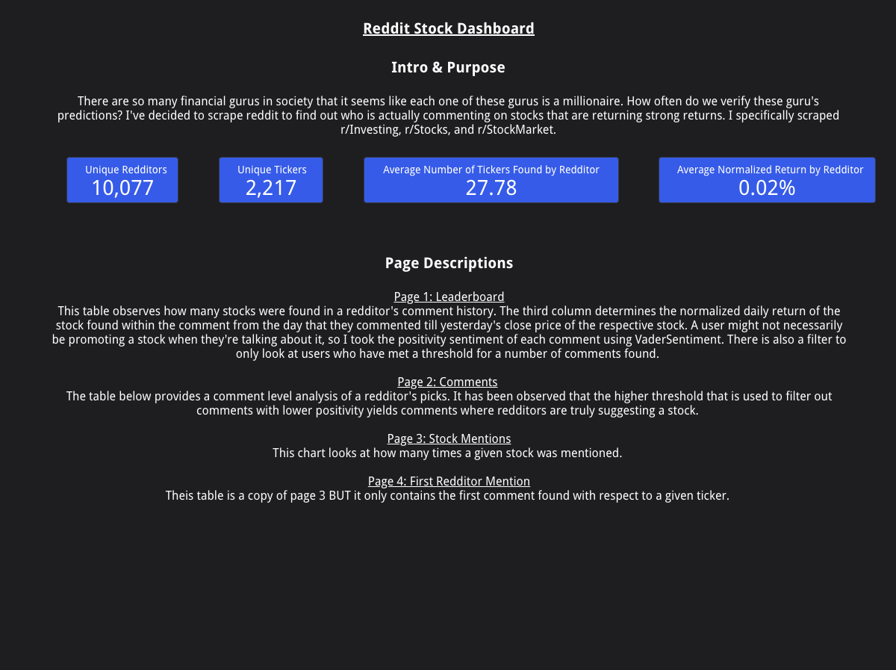

# Reddit Scraper For Stock Picks
## Summary
This repository contains python scripts which will scrape r/Stocks, r/Investing, and r/StockMarket. The goal is to scrape comments where there has been a stock ticker identified within the comment. The goal is to find redditors who consistently suggest stocks which provide high returns.

## How to get up and running
#### Reddit Application
In order to use this repo, users must create a reddit application. Felippe Rodrigues wrote a great article on how to go about getting those credentials. The link to that article is provided below: 

https://www.storybench.org/how-to-scrape-reddit-with-python/

#### Python Module Requirements
###### All the libraries used in this example can be installed using pip with the requirements.txt file included. Open any terminal or command prompt and type in the following line. Use conda install if working with a conda environment. 
```python
pip install requirements.txt
```

## Current Processing Methodology
1. Scrape Reddit 
    1. Scrape new posts for r/stocks, r/investing, r/stockmarket.
    1. If a new user is identified when scraping, scrape all of that user's comments. 
    1. Use Named Entity Recogntion (**NER**) to identify stocks within comments

1. Find stock value for day comment was posted
    1. Use yfinance to pull data for all stocks found.
    2. Calculate the return if a redditor had bought one share the day that he/she posted the initial commment. 
    3. Calculate the average daily return by comment where only the number of weekdays are taken into consideration.
     
1. Export to google sheets
   

## Dashboard
There is a dashboard which looks at this data which can be found in the following link. 
https://datastudio.google.com/reporting/7d5c20ed-b6a6-4162-81ba-062bf869c5c0/page/z9ScB

Below is the first page on the link above.


Below is the second page on the link above.


Below is the third page on the link above.
